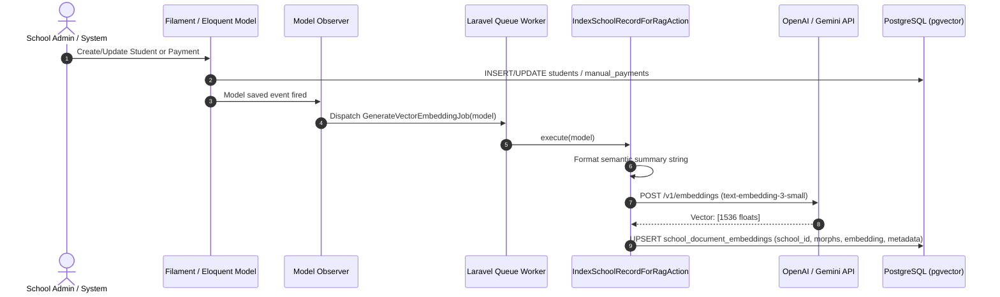
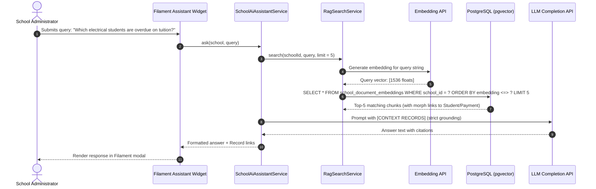

# ADR 0001: AI-Powered Trade School Assistant & Semantic Search Architecture

* **Status:** Proposed
* **Date:** 2026-08-19
* **Author:** Architecture & Engineering Team
* **Target Stack:** PHP 8.4+, Laravel 12+, PostgreSQL with `pgvector`, Filament 3.x, OpenAI / Gemini (`text-embedding-3-small`, `gpt-4o-mini`), Pest 5.x, PHPStan (Level 8)

---

## 1. Context & Executive Summary

### 1.1 The Business Goal
Trade school administrators manage complex operational data spanning **student enrollments**, **tuition/manual payment balances**, **program certifications (e.g., Electrical, Welding, HVAC)**, and **school compliance policies**. 

Traditional relational queries require administrators to navigate multiple distinct tables, filters, and reports to answer day-to-day administrative questions. Lexical search (SQL `LIKE` or basic text search) fails when administrators ask conceptual, fuzzy, or cross-cutting questions such as:
* *"Which electrical trade students are overdue on tuition?"*
* *"What is our refund policy for withdrawn students?"*
* *"Show me students at risk of drop-out in the Welding program due to missed payments."*

### 1.2 The Solution: Multi-Tenant Vector RAG Architecture
This architecture establishes a **multi-tenant, AI-native RAG (Retrieval-Augmented Generation)** assistant built directly inside Laravel and PostgreSQL:
1. **Multi-Tenant Vector Storage:** PostgreSQL with the `pgvector` extension stores 1,536-dimension floating point embeddings with HNSW cosine indexes partitioned per school (`school_id`).
2. **Polymorphic Chunk Ingestion:** Domain records (`Student`, `ManualPayment`, `CompliancePolicy`) are automatically formatted into readable semantic text summaries and embedded asynchronously on change.
3. **In-Database Vector Similarity Querying:** Executes native cosine distance queries using pgvector's `<=>` operator directly alongside tenant SQL scopes.
4. **Context-Grounded LLM Assistant ("Lumion AI"):** Assembles retrieved domain chunks into a strict system prompt and invokes an LLM (`gpt-4o-mini` / `gemini-1.5-flash`) to generate precise, hallucination-free answers with direct record citations.
5. **Filament 3 Native Admin UI:** School administrators interact via a custom Filament dashboard widget / modal with prompt pills, real-time responses, and clickable source links to Filament resource records.

---

## 2. Technical Stack & Standards

| Component | Technology | Version / Specification |
| :--- | :--- | :--- |
| **Language & Runtime** | PHP | `^8.4` with `declare(strict_types=1)` & `CarbonImmutable` |
| **Framework** | Laravel | `12.x` / `13.x` |
| **Primary Database & Vectors** | PostgreSQL + `pgvector` | `pgvector/pgvector` package (`vector(1536)` + HNSW index) |
| **Admin Panel UI** | Filament | `3.x` (Livewire 3 + Tailwind CSS + Alpine.js) |
| **AI / Embedding SDK** | OpenAI PHP / Gemini | `openai-php/laravel` (`text-embedding-3-small` & `gpt-4o-mini`) |
| **Testing Framework** | Pest PHP | `pestphp/pest` with Mocking & RefreshDatabase |
| **Code Style & Static Analysis** | Laravel Pint & PHPStan | PER-CS / PSR-12, PHPStan Level 8 |

---

## 3. System Architecture & Workflows

### 3.1 Domain Ingestion Pipeline



---

### 3.2 RAG Semantic Search & LLM Assistant Flow



---

## 4. Detailed Implementation Blueprint

### Phase 1: Package & Database Setup
1. **Configure PostgreSQL with `pgvector`:**
   - Update `.env` to use `DB_CONNECTION=pgsql`.
   - Install the official pgvector Laravel package:
     ```bash
     composer require pgvector/pgvector
     ```
2. **Install Filament & AI SDKs:**
   ```bash
   composer require filament/filament:"^3.2" -W
   composer require openai-php/laravel
   ```
3. **Publish Configurations:**
   - Publish OpenAI configuration (`php artisan vendor:publish --provider="OpenAI\Laravel\ServiceProvider"`).
   - Configure `OPENAI_API_KEY`, `AI_EMBEDDING_MODEL=text-embedding-3-small`, and `AI_CHAT_MODEL=gpt-4o-mini` in `.env`.

---

### Phase 2: Domain Schema & Vector Migrations

#### 1. Enable `pgvector` Extension Migration
```php
// database/migrations/0001_01_01_000010_enable_pgvector_extension.php
use Illuminate\Database\Migrations\Migration;
use Illuminate\Support\Facades\DB;

return new class extends Migration {
    public function up(): void
    {
        DB::statement('CREATE EXTENSION IF NOT EXISTS vector');
    }

    public function down(): void
    {
        DB::statement('DROP EXTENSION IF EXISTS vector');
    }
};
```

#### 2. Core Trade School Domain Tables
```php
// database/migrations/0001_01_01_000020_create_trade_school_tables.php
use Illuminate\Database\Migrations\Migration;
use Illuminate\Database\Schema\Blueprint;
use Illuminate\Support\Facades\Schema;

return new class extends Migration {
    public function up(): void
    {
        Schema::create('schools', function (Blueprint $table) {
            $table->id();
            $table->string('name');
            $table->string('slug')->unique();
            $table->timestamps();
        });

        Schema::create('students', function (Blueprint $table) {
            $table->id();
            $table->foreignId('school_id')->constrained()->cascadeOnDelete();
            $table->string('name');
            $table->string('email');
            $table->string('program_name'); // e.g. "Electrical", "Welding", "HVAC"
            $table->string('enrollment_status')->default('active'); // active, graduated, withdrawn, suspended
            $table->timestamps();

            $table->index(['school_id', 'enrollment_status']);
        });

        Schema::create('manual_payments', function (Blueprint $table) {
            $table->id();
            $table->foreignId('school_id')->constrained()->cascadeOnDelete();
            $table->foreignId('student_id')->constrained()->cascadeOnDelete();
            $table->unsignedBigInteger('amount_in_cents');
            $table->string('type'); // tuition, lab_fees, tools, certification_exam
            $table->string('status')->default('pending'); // pending, paid, overdue, refunded
            $table->date('due_date');
            $table->timestamp('paid_at')->nullable();
            $table->timestamps();

            $table->index(['school_id', 'status', 'due_date']);
        });
    }

    public function down(): void
    {
        Schema::dropIfExists('manual_payments');
        Schema::dropIfExists('students');
        Schema::dropIfExists('schools');
    }
};
```

#### 3. Vector Embeddings Table with HNSW Index
```php
// database/migrations/0001_01_01_000030_create_school_document_embeddings_table.php
use Illuminate\Database\Migrations\Migration;
use Illuminate\Database\Schema\Blueprint;
use Illuminate\Support\Facades\DB;
use Illuminate\Support\Facades\Schema;

return new class extends Migration {
    public function up(): void
    {
        Schema::create('school_document_embeddings', function (Blueprint $table) {
            $table->uuid('id')->primary();
            $table->foreignId('school_id')->constrained()->cascadeOnDelete();
            $table->uuidMorphs('documentable'); // morphs to Student, ManualPayment, Policy
            $table->text('content_chunk');
            $table->jsonb('metadata')->nullable();
            
            // 1536-dimensional vector column
            $table->vector('embedding', 1536);
            
            $table->timestamps();

            $table->index(['school_id', 'documentable_type']);
        });

        // Fast Approximate Nearest Neighbor (ANN) index using Cosine Distance
        DB::statement('CREATE INDEX school_doc_embeddings_hnsw_idx ON school_document_embeddings USING hnsw (embedding vector_cosine_ops)');
    }

    public function down(): void
    {
        Schema::dropIfExists('school_document_embeddings');
    }
};
```

---

### Phase 3: Embedding Ingestion Service & Actions

#### 1. `App\Services\Ai\EmbeddingService`
```php
namespace App\Services\Ai;

use OpenAI\Laravel\Facades\OpenAI;
use RuntimeException;

class EmbeddingService
{
    /**
     * Convert text into a 1536-dimension float array using OpenAI embeddings.
     *
     * @return array<int, float>
     */
    public function generateEmbedding(string $text): array
    {
        $cleaned = trim(preg_replace('/\s+/', ' ', $text) ?? '');
        if (empty($cleaned)) {
            return [];
        }

        $response = OpenAI::embeddings()->create([
            'model' => config('ai.embedding.model', 'text-embedding-3-small'),
            'input' => $cleaned,
            'dimensions' => 1536,
        ]);

        return $response->embeddings[0]->embedding ?? [];
    }
}
```

#### 2. `App\Actions\IndexSchoolRecordForRagAction`
```php
namespace App\Actions;

use App\Models\ManualPayment;
use App\Models\SchoolDocumentEmbedding;
use App\Models\Student;
use App\Services\Ai\EmbeddingService;
use Illuminate\Database\Eloquent\Model;
use Illuminate\Support\Str;

class IndexSchoolRecordForRagAction
{
    public function __construct(protected EmbeddingService $embeddingService) {}

    public function execute(Model $record): ?SchoolDocumentEmbedding
    {
        $summary = $this->buildSemanticSummary($record);
        if (empty($summary)) {
            return null;
        }

        $vector = $this->embeddingService->generateEmbedding($summary);
        if (empty($vector)) {
            return null;
        }

        return SchoolDocumentEmbedding::updateOrCreate(
            [
                'school_id' => $record->school_id,
                'documentable_type' => $record->getMorphClass(),
                'documentable_id' => (string) $record->getKey(),
            ],
            [
                'id' => Str::uuid()->toString(),
                'content_chunk' => $summary,
                'metadata' => [
                    'title' => $record instanceof Student ? $record->name : "Payment for Student #{$record->student_id}",
                    'updated_at' => now()->toIso8601String(),
                ],
                'embedding' => $vector,
            ]
        );
    }

    protected function buildSemanticSummary(Model $record): string
    {
        if ($record instanceof Student) {
            return sprintf(
                "Student %s (Email: %s) enrolled in the %s program. Enrollment Status: %s. School ID: %d.",
                $record->name,
                $record->email,
                $record->program_name,
                ucfirst($record->enrollment_status),
                $record->school_id
            );
        }

        if ($record instanceof ManualPayment) {
            $record->loadMissing('student');
            $formattedAmount = number_format($record->amount_in_cents / 100, 2);
            return sprintf(
                "Payment Record for Student %s in %s program. Type: %s. Amount: $%s. Status: %s. Due Date: %s. Paid At: %s.",
                $record->student?->name ?? 'Unknown',
                $record->student?->program_name ?? 'Unknown',
                str_replace('_', ' ', $record->type),
                $formattedAmount,
                strtoupper($record->status),
                $record->due_date->format('Y-m-d'),
                $record->paid_at ? $record->paid_at->format('Y-m-d H:i') : 'Not paid'
            );
        }

        return '';
    }
}
```

#### 3. Queued Background Job & Observers
```php
namespace App\Jobs;

use App\Actions\IndexSchoolRecordForRagAction;
use Illuminate\Bus\Queueable;
use Illuminate\Contracts\Queue\ShouldQueue;
use Illuminate\Database\Eloquent\Model;
use Illuminate\Foundation\Bus\Dispatchable;
use Illuminate\Queue\InteractsWithQueue;
use Illuminate\Queue\SerializesModels;

class GenerateVectorEmbeddingJob implements ShouldQueue
{
    use Dispatchable, InteractsWithQueue, Queueable, SerializesModels;

    public int $tries = 3;
    public int $backoff = 5;

    public function __construct(public Model $record) {}

    public function handle(IndexSchoolRecordForRagAction $action): void
    {
        $action->execute($this->record);
    }
}
```

---

### Phase 4: The RAG Semantic Search & LLM Engine

#### 1. `App\Services\Ai\RagSearchService`
```php
namespace App\Services\Ai;

use App\Models\SchoolDocumentEmbedding;
use Illuminate\Database\Eloquent\Collection;
use Pgvector\Laravel\Vector;

class RagSearchService
{
    public function __construct(protected EmbeddingService $embeddingService) {}

    /**
     * Search nearest document chunks for a school using pgvector cosine distance (<=>).
     *
     * @return Collection<int, SchoolDocumentEmbedding>
     */
    public function search(int $schoolId, string $query, int $limit = 5): Collection
    {
        $queryVector = $this->embeddingService->generateEmbedding($query);
        if (empty($queryVector)) {
            return new Collection();
        }

        return SchoolDocumentEmbedding::query()
            ->where('school_id', $schoolId)
            ->orderByRaw('embedding <=> ?', [new Vector($queryVector)])
            ->limit($limit)
            ->get();
    }
}
```

#### 2. `App\Services\Ai\SchoolAiAssistantService`
```php
namespace App\Services\Ai;

use App\Models\School;
use OpenAI\Laravel\Facades\OpenAI;

class SchoolAiAssistantService
{
    public function __construct(protected RagSearchService $ragSearchService) {}

    /**
     * Answer an administrator's query with strict grounding against school records.
     *
     * @return array{answer: string, chunks: array<int, array<string, mixed>>}
     */
    public function ask(School $school, string $question): array
    {
        $matchedChunks = $this->ragSearchService->search($school->id, $question, limit: 5);

        if ($matchedChunks->isEmpty()) {
            return [
                'answer' => 'I could not find records matching that inquiry.',
                'chunks' => [],
            ];
        }

        $contextSnippets = $matchedChunks->map(function ($chunk, int $i) {
            $num = $i + 1;
            return "[RECORD #{$num}]: {$chunk->content_chunk}";
        })->implode("\n\n");

        $systemPrompt = <<<PROMPT
You are Lumion AI, the operating system assistant for trade schools.
Answer the administrator's question using ONLY the provided school records below.
If the answer cannot be found in the context, say "I could not find records matching that inquiry."
Do not extrapolate or speculate. Cite the specific student names and amounts directly.

[CONTEXT RECORDS]:
{$contextSnippets}
PROMPT;

        $response = OpenAI::chat()->create([
            'model' => config('ai.chat.model', 'gpt-4o-mini'),
            'temperature' => 0.1,
            'messages' => [
                ['role' => 'system', 'content' => $systemPrompt],
                ['role' => 'user', 'content' => $question],
            ],
        ]);

        $answer = $response->choices[0]->message->content ?? 'No response generated.';

        $sources = $matchedChunks->map(fn ($chunk) => [
            'type' => class_basename($chunk->documentable_type),
            'id' => $chunk->documentable_id,
            'content' => $chunk->content_chunk,
        ])->all();

        return [
            'answer' => $answer,
            'chunks' => $sources,
        ];
    }
}
```

---

### Phase 5: Filament 3 Admin UI & AI Chat Assistant
* **Filament Widget / Modal (`SchoolAiAssistantWidget`):**
  - Integrated into the Filament Admin Dashboard for quick access.
  - Interactive prompt pill shortcuts:
    - *"Who has overdue payments in the Electrical program?"*
    - *"What is our student retention rate this term?"*
    - *"List all withdrawn students with pending equipment fees."*
  - Livewire real-time submission with formatted Markdown response rendering.
  - Interactive "Sources Used" accordion linking directly to the corresponding Filament Student and Payment Resource pages (`/admin/students/{id}`).

---

### Phase 6: Pest PHP Test Suite

#### 1. Unit Tests (`tests/Unit/EmbeddingServiceTest.php`)
```php
use App\Services\Ai\EmbeddingService;
use OpenAI\Laravel\Facades\OpenAI;
use OpenAI\Responses\Embeddings\CreateResponse;

test('embedding service generates 1536 dimension float array', function () {
    $fakeVector = array_fill(0, 1536, 0.042);

    OpenAI::fake([
        CreateResponse::fake([
            'embeddings' => [
                ['embedding' => $fakeVector],
            ],
        ]),
    ]);

    $service = new EmbeddingService();
    $embedding = $service->generateEmbedding('Test Student Welding');

    expect($embedding)->toHaveCount(1536)
        ->and($embedding[0])->toBe(0.042);
});
```

#### 2. Feature Tests (`tests/Feature/RagSearchTest.php`)
```php
use App\Actions\IndexSchoolRecordForRagAction;
use App\Models\School;
use App\Models\Student;
use App\Services\Ai\EmbeddingService;
use App\Services\Ai\RagSearchService;
use OpenAI\Laravel\Facades\OpenAI;
use OpenAI\Responses\Embeddings\CreateResponse;

test('rag search retrieves semantically close records and enforces multi-tenant isolation', function () {
    $schoolA = School::factory()->create(['name' => 'Apex Trade Institute']);
    $schoolB = School::factory()->create(['name' => 'Metro Technical Academy']);

    $studentA = Student::factory()->create([
        'school_id' => $schoolA->id,
        'name' => 'Marcus Vance',
        'program_name' => 'Electrical',
    ]);

    $studentB = Student::factory()->create([
        'school_id' => $schoolB->id,
        'name' => 'Secret Student',
        'program_name' => 'Electrical',
    ]);

    // Mock embedding generation
    OpenAI::fake([
        CreateResponse::fake(['embeddings' => [['embedding' => array_fill(0, 1536, 0.1)]]]),
    ]);

    $indexer = app(IndexSchoolRecordForRagAction::class);
    $indexer->execute($studentA);
    $indexer->execute($studentB);

    $ragSearch = app(RagSearchService::class);
    $resultsA = $ragSearch->search($schoolA->id, 'Electrical student Marcus');

    // Multi-tenant check: School A must see Marcus but NEVER School B's student
    expect($resultsA)->toHaveCount(1)
        ->and($resultsA->first()->content_chunk)->toContain('Marcus Vance')
        ->and($resultsA->pluck('content_chunk'))->not->toContain('Secret Student');
});
```

#### 3. Assistant Feature Tests (`tests/Feature/SchoolAiAssistantTest.php`)
```php
use App\Models\School;
use App\Services\Ai\RagSearchService;
use App\Services\Ai\SchoolAiAssistantService;
use Illuminate\Database\Eloquent\Collection;
use OpenAI\Laravel\Facades\OpenAI;
use OpenAI\Responses\Chat\CreateResponse;

test('assistant constructs grounded prompt and returns answer', function () {
    $school = School::factory()->create();

    $mockSearch = Mockery::mock(RagSearchService::class);
    $mockSearch->shouldReceive('search')
        ->once()
        ->andReturn(new Collection([
            (object) ['content_chunk' => 'Student Alex is overdue by $500 in Electrical.'],
        ]));

    OpenAI::fake([
        CreateResponse::fake([
            'choices' => [
                ['message' => ['content' => 'Alex in the Electrical program is overdue by $500.']],
            ],
        ]),
    ]);

    $assistant = new SchoolAiAssistantService($mockSearch);
    $result = $assistant->ask($school, 'Who is overdue in Electrical?');

    expect($result['answer'])->toContain('Alex in the Electrical program is overdue by $500.')
        ->and($result['chunks'])->toHaveCount(1);
});
```

---

### Phase 7: Code Quality & Verification Standards
* **Formatting:** Run `./vendor/bin/pint` to enforce PER-CS / PSR-12 standard.
* **Static Analysis:** Run `./vendor/bin/phpstan analyse --level=8` for strict type safety.
* **Testing:** Run `php artisan test --compact` to verify all unit and feature tests pass.

---

## 5. Summary of Decision & Benefits

1. **Native Single-Stack Architecture:** Zero external microservices or standalone vector DBs needed—PostgreSQL `pgvector` provides ACID guarantees, multi-tenant relational integrity, and fast HNSW index cosine distance searching in a single database engine.
2. **Deterministic Context Grounding:** Eliminates LLM hallucinations by enforcing strict context boundaries inside `SchoolAiAssistantService`.
3. **Seamless Filament 3 Integration:** School staff query records without leaving their administrative workflow.
4. **Asynchronous Ingestion:** Background queue jobs ensure model creations and edits remain snappy and non-blocking for end users.
