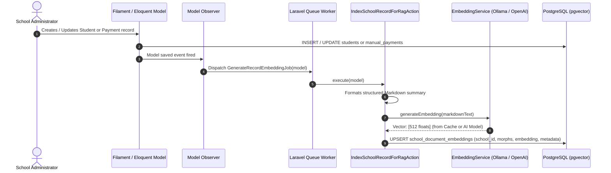
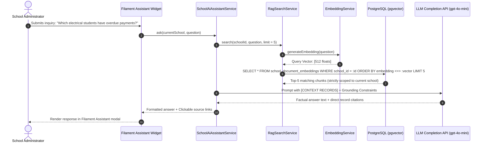

# ADR 0001: Multi-Tenant AI Assistant (Lumion AI) & Polymorphic Document RAG Architecture

* **Status:** Accepted (2026-08-19)
* **Author:** Architecture & Engineering Team
* **Target Stack:** PHP 8.4+, Laravel 12+, PostgreSQL with `pgvector`, Filament 3.x, Ollama (`nomic-embed-text`) / OpenAI (`text-embedding-3-small`, `gpt-4o-mini`), Pest 5.x, PHPStan (Level 8)
* **Related Records:**
  * [ADR-0002: Semantic Article Recommendations via In-Database Vector Proximity](file:///Users/bryanmiller/dev/apps/wt-vectors-example-slow/documentation/ADR-0002-article-semantic-recommendations-via-vector-proximity.md) *(Foundational vector proximity layer)*
  * [ADR-0003: Environment Setup, Local Onboarding, and Vector Operations](file:///Users/bryanmiller/dev/apps/wt-vectors-example-slow/documentation/ADR-0003-environment-setup-and-local-onboarding.md) *(Environment, Docker pgvector, and Ollama setup)*

---

## 1. Context & Problem Statement

### 1.1 The Operational Challenge
Trade school administrators manage high-stakes, multi-tenant operational data across **student enrollments**, **tuition and fee balances**, **vocational certifications**, and **institutional compliance policies**.

Traditional relational queries require administrators to manually cross-reference separate tables and filters to answer administrative questions. Lexical search (`LIKE '%query%'` or basic full-text search) fails when administrators ask conceptual, fuzzy, or cross-cutting questions such as:
* *"Which electrical trade students have overdue tuition balances?"*
* *"What is our refund and room-and-board fee schedule for withdrawn apprentices?"*
* *"Identify students in the Welding program at risk of suspension due to missing tool kit payments."*

### 1.2 The Solution
Building upon the vector proximity foundation proven in [ADR-0002](file:///Users/bryanmiller/dev/apps/wt-vectors-example-slow/documentation/ADR-0002-article-semantic-recommendations-via-vector-proximity.md), this architecture implements a **Multi-Tenant Retrieval-Augmented Generation (RAG) AI Assistant ("Lumion AI")** embedded directly within Laravel and PostgreSQL:

1. **Multi-Tenant Vector Isolation:** 512-dimension vector embeddings stored in PostgreSQL via `pgvector`, hard-scoped by `school_id` and indexed with HNSW cosine distance indexes.
2. **Polymorphic Chunk Ingestion:** Domain records (`Student`, `ManualPayment`, `CompliancePolicy`) are automatically formatted as structured Markdown summaries and embedded asynchronously on change.
3. **Hybrid In-Database Retrieval:** Combines relational SQL tenant constraints (`WHERE school_id = ?`) with native `<=>` vector cosine similarity queries.
4. **Strictly-Grounded LLM Synthesis:** Assembles retrieved tenant records into a constrained prompt passed to an LLM (`gpt-4o-mini` / local LLM), producing factual, hallucination-free answers with direct record citations.
5. **Filament 3 Native Assistant Panel:** Provides school administrators with an embedded interactive assistant widget featuring prompt pills, real-time responses, and direct deep-links to administrative resource pages.

---

## 2. Technical Stack & Core Standards

| Component | Technology / Specification | Standard & Rationale |
| :--- | :--- | :--- |
| **Language & Runtime** | PHP `^8.4` | Strictly typed with `declare(strict_types=1);` and `CarbonImmutable`. |
| **Framework** | Laravel `12.x` / `13.x` | Standardized service architecture with queued background jobs. |
| **Primary Database & Vectors** | PostgreSQL 16 + `pgvector` | `vector('embedding', 512)` with `USING hnsw (embedding vector_cosine_ops)`. |
| **Domain Enums** | Backed Enums | `TradeProgram`, `PaymentType`, `PaymentStatus`, `EnrollmentStatus`. |
| **AI Embedding Engine** | Dual-Engine Provider | Local **Ollama** (`nomic-embed-text`) for dev; Cloud **OpenAI** for production. |
| **LLM Synthesis Model** | `gpt-4o-mini` | Low temperature (`0.1`) for deterministic factual context grounding. |
| **Admin Panel UI** | Filament `3.x` | Livewire 3 + Tailwind CSS embedded assistant widgets. |
| **Testing & Quality** | Pest PHP & PHPStan | Comprehensive feature tests, PHPStan Level 8, and Laravel Pint. |

> [!NOTE]
> For complete instructions on spinning up the PostgreSQL Docker container, installing Ollama, or configuring `.env`, refer to **[ADR-0003: Environment Setup and Local Onboarding](file:///Users/bryanmiller/dev/apps/wt-vectors-example-slow/documentation/ADR-0003-environment-setup-and-local-onboarding.md)**.

---

## 3. System Architecture & Workflows

### 3.1 Asynchronous Polymorphic Ingestion Pipeline



---

### 3.2 Multi-Tenant RAG Search & LLM Assistant Query Flow



---

## 4. Implementation Blueprint

### 4.1 Domain Schema & Backed Enums

All domain models use strictly typed backed enums to ensure data integrity across the platform:

```php
// app/Enums/TradeProgram.php
enum TradeProgram: string
{
    case Electrical = 'electrical';
    case Welding = 'welding';
    case Hvac = 'hvac';
    case Plumbing = 'plumbing';
    case Automotive = 'automotive';
    case Carpentry = 'carpentry';
}

// app/Enums/PaymentType.php
enum PaymentType: string
{
    case Tuition = 'tuition';
    case LabFees = 'lab_fees';
    case Tools = 'tools';
    case RoomAndBoard = 'room_and_board';
}

// app/Enums/PaymentStatus.php
enum PaymentStatus: string
{
    case Pending = 'pending';
    case Paid = 'paid';
    case Overdue = 'overdue';
    case Refunded = 'refunded';
}

// app/Enums/EnrollmentStatus.php
enum EnrollmentStatus: string
{
    case Active = 'active';
    case Graduated = 'graduated';
    case Withdrawn = 'withdrawn';
    case Suspended = 'suspended';
}
```

---

### 4.2 Polymorphic Embeddings Table (`school_document_embeddings`)

The `school_document_embeddings` table stores vectorized representations for any school-scoped entity (`Student`, `ManualPayment`, `CompliancePolicy`) with an HNSW cosine index:

```php
// database/migrations/0001_01_01_000007_create_school_document_embeddings_table.php
Schema::create('school_document_embeddings', function (Blueprint $table) {
    $table->uuid('id')->primary();
    $table->foreignId('school_id')->constrained()->cascadeOnDelete();
    $table->morphs('documentable'); // morphs to Student, ManualPayment, Policy
    $table->text('content_chunk');

    if (DB::getDriverName() === 'pgsql') {
        $table->jsonb('metadata')->nullable();
        $table->vector('embedding', 512);
    } else {
        $table->json('metadata')->nullable();
        $table->json('embedding')->nullable();
    }

    $table->timestamps();

    $table->index(['school_id', 'documentable_type']);
});

if (DB::getDriverName() === 'pgsql') {
    DB::statement('CREATE INDEX school_doc_embeddings_hnsw_idx ON school_document_embeddings USING hnsw (embedding vector_cosine_ops)');
}
```

---

### 4.3 Markdown Document Ingestion Action

Documents are formatted into clean Markdown before vectorization to eliminate JSON token noise and preserve semantic hierarchy:

```php
namespace App\Actions;

use App\Models\ManualPayment;
use App\Models\SchoolDocumentEmbedding;
use App\Models\Student;
use App\Services\Ai\EmbeddingService;
use Illuminate\Database\Eloquent\Model;
use Illuminate\Support\Str;

class IndexSchoolRecordForRagAction
{
    public function __construct(protected EmbeddingService $embeddingService) {}

    public function execute(Model $record): ?SchoolDocumentEmbedding
    {
        $markdown = $this->buildSemanticMarkdown($record);
        if ($markdown === '') {
            return null;
        }

        $vector = $this->embeddingService->generateEmbedding($markdown);
        if (empty($vector)) {
            return null;
        }

        return SchoolDocumentEmbedding::updateOrCreate(
            [
                'school_id' => $record->school_id,
                'documentable_type' => $record->getMorphClass(),
                'documentable_id' => (string) $record->getKey(),
            ],
            [
                'id' => Str::uuid()->toString(),
                'content_chunk' => $markdown,
                'metadata' => [
                    'title' => $record instanceof Student ? $record->name : "Payment #{$record->id}",
                    'updated_at' => now()->toIso8601String(),
                ],
                'embedding' => $vector,
            ]
        );
    }

    protected function buildSemanticMarkdown(Model $record): string
    {
        if ($record instanceof Student) {
            return <<<MARKDOWN
            # Student: {$record->name}
            **Program:** {$record->program_name->value}
            **Status:** {$record->enrollment_status->value}
            **Email:** {$record->email}
            **School ID:** {$record->school_id}
            MARKDOWN;
        }

        if ($record instanceof ManualPayment) {
            $record->loadMissing('student');
            $formattedAmount = number_format($record->amount_in_cents / 100, 2);

            return <<<MARKDOWN
            # Payment Record for Student {$record->student?->name}
            **Trade Program:** {$record->student?->program_name?->value}
            **Payment Category:** {$record->type->value}
            **Amount:** \${$formattedAmount}
            **Status:** {$record->status->value}
            **Due Date:** {$record->due_date->format('Y-m-d')}
            **Paid At:** {$record->paid_at?->format('Y-m-d H:i') ?? 'Not paid'}
            MARKDOWN;
        }

        return '';
    }
}
```

---

### 4.4 Tenant-Scoped RAG Search Service

Executes hybrid search ensuring **100% strict multi-tenant isolation** by combining `where('school_id', $schoolId)` with vector proximity:

```php
namespace App\Services\Ai;

use App\Models\SchoolDocumentEmbedding;
use Illuminate\Database\Eloquent\Collection;
use Pgvector\Laravel\Vector;

class RagSearchService
{
    public function __construct(protected EmbeddingService $embeddingService) {}

    /**
     * Search nearest document chunks strictly scoped to a specific school tenant.
     *
     * @return Collection<int, SchoolDocumentEmbedding>
     */
    public function search(int $schoolId, string $query, int $limit = 5): Collection
    {
        $queryVector = $this->embeddingService->generateEmbedding($query);
        if (empty($queryVector)) {
            return new Collection();
        }

        /** @var Collection<int, SchoolDocumentEmbedding> $results */
        $results = SchoolDocumentEmbedding::query()
            ->where('school_id', $schoolId)
            ->orderByRaw('embedding <=> ?', [new Vector($queryVector)])
            ->limit($limit)
            ->get();

        return $results;
    }
}
```

---

### 4.5 Grounded Assistant Synthesis Service ("Lumion AI")

Answers administrative inquiries using retrieved records as strict context boundaries:

```php
namespace App\Services\Ai;

use App\Models\School;
use OpenAI\Laravel\Facades\OpenAI;

class SchoolAiAssistantService
{
    public function __construct(protected RagSearchService $ragSearchService) {}

    /**
     * Answer an administrator's query strictly grounded in their school's records.
     *
     * @return array{answer: string, chunks: array<int, array<string, mixed>>}
     */
    public function ask(School $school, string $question): array
    {
        $matchedChunks = $this->ragSearchService->search($school->id, $question, limit: 5);

        if ($matchedChunks->isEmpty()) {
            return [
                'answer' => 'I could not find records matching that inquiry for this school.',
                'chunks' => [],
            ];
        }

        $contextSnippets = $matchedChunks->map(function (SchoolDocumentEmbedding $chunk, int $i): string {
            $num = $i + 1;
            return "[RECORD #{$num}]:\n{$chunk->content_chunk}";
        })->implode("\n\n---\n\n");

        $systemPrompt = <<<PROMPT
        You are Lumion AI, the intelligent operating assistant for trade schools.
        Answer the administrator's question using ONLY the provided school records below.
        If the answer cannot be determined from the context, state: "I could not find records matching that inquiry."
        Do not extrapolate or speculate. Cite specific student names, program trades, and dollar amounts directly.

        [CONTEXT RECORDS]:
        {$contextSnippets}
        PROMPT;

        $response = OpenAI::chat()->create([
            'model' => (string) config('ai.chat.model', 'gpt-4o-mini'),
            'temperature' => (float) config('ai.chat.temperature', 0.1),
            'messages' => [
                ['role' => 'system', 'content' => $systemPrompt],
                ['role' => 'user', 'content' => $question],
            ],
        ]);

        $answer = $response->choices[0]->message->content ?? 'No response generated.';

        $sources = $matchedChunks->map(fn (SchoolDocumentEmbedding $chunk): array => [
            'type' => class_basename($chunk->documentable_type),
            'id' => $chunk->documentable_id,
            'title' => $chunk->metadata['title'] ?? 'Record',
            'content' => $chunk->content_chunk,
        ])->all();

        return [
            'answer' => $answer,
            'chunks' => $sources,
        ];
    }
}
```

---

## 5. Security, Multi-Tenancy, and Isolation Guarantees

1. **Guaranteed Tenant Partitioning:**
   * In-database vector search enforces `WHERE school_id = :current_school_id` on every query.
   * School A administrators can **never** retrieve or leak School B embeddings, records, or policy documents.
2. **Deterministic Context Grounding:**
   * LLM temperature is locked at `0.1` to prevent hallucinations and strictly enforce record-derived answers.
3. **ACID-Compliant Single-Engine Storage:**
   * Relational data and vector embeddings live side-by-side in PostgreSQL. Cascade deletes on `School` or `Student` automatically remove corresponding embeddings with full referential integrity.
